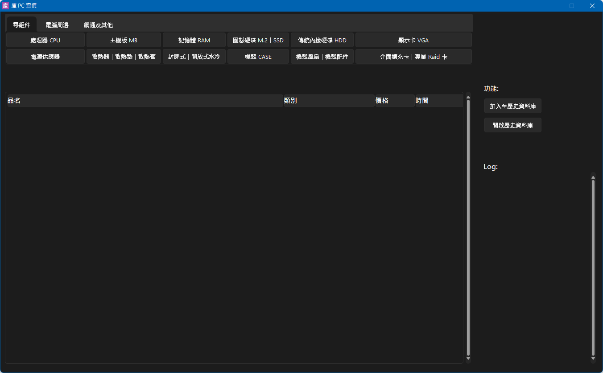

# Coolpc Crawler + GUI + History Price Database

What is updated in this fork

1. No changes of `%AppData%` (keep this program "portable")
2. Add missing stuff, e.g. `.gitignore`, `requirements.txt`
3. Use it as Python program instead of Windows exe

## Getting Started

```bash
git clone https://github.com/daviddwlee84/Coolpc.git
cd Coolpc

git submodule init
git submodule update

pip install -r requirements.txt
```

```bash
python coolpc_gui.py
```



## Resources

- [原價屋線上估價-含稅](https://coolpc.com.tw/evaluate.php)
- [原價屋查價-行動版](https://www.coolpc.com.tw/m/)

Related Projects

- [vincent-chang-rightfighter/Kupc: 原價屋爬蟲配合 Sqlite3 資料庫桌面端程式](https://github.com/vincent-chang-rightfighter/Kupc)
- [vincent-chang-rightfighter/coolpc-crawler-sqlitedb-with-gspread: coolpc crawler with sqlite and gspread](https://github.com/vincent-chang-rightfighter/coolpc-crawler-sqlitedb-with-gspread)
- [scsa3/coolpc-parser: 原價屋簡單爬蟲](https://github.com/scsa3/coolpc-parser)

Packages

- [gnikit/tkinter-tooltip: A ToolTip widget for tkinter](https://github.com/gnikit/tkinter-tooltip)
